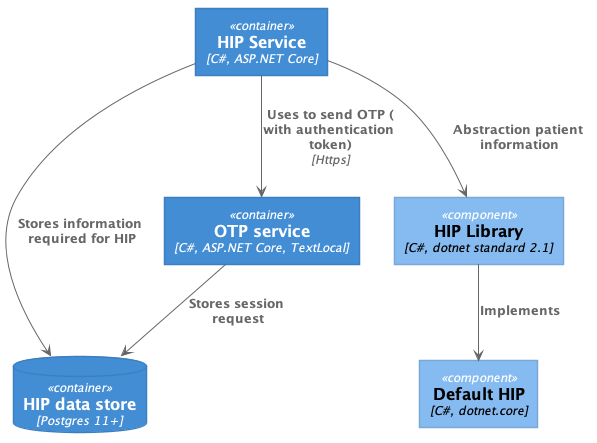

# Architecture

HIP service roles and responsibilities are common across all hospitals except where is the source of patient demography and health records are.

There are 3 important components

1. HIP service
2. OTP Service
3. HIP Library

## HIP Service

Core application logic of Health Information Provider in terms of NCG such as discovery, link, data flow which are being packaged into HIP service accordingly. And, interaction points with EMR system which are being abstracted out from this completely.

## OTP Service

There are scenarios when HIP needs to notify a patient for example, OTP during link enquiry, hence, OTP service is being built to satisfy that purpose. Currently, it uses [text local](https://www.textlocal.in/) to send an OTP.

## HIP Library

Abstraction of interaction point with EMR system from HIP service is being built into HIP library, for example during discovery need to fetch patients who has verified mobile number in their record. 

### Default HIP

It is a sample implementation of HIP Library. Data source for this service is simple json files.